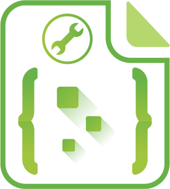

<p align="center">
  
</p>

<h1 align="center">Nextdoc4j Demo</h1>

<p align="center">
  <strong>🚀 NextDoc4j 多架构演示工程（Spring Boot 3 / 4 双轨）</strong><br>
  演示单体与网关微服务两种接入方式，并支持 SB3 与 SB4 并行运行。
</p>

<p align="center">
  🌐 <a href="https://demo.nextdoc4j.top/">在线演示</a> |
  📘 <a href="https://nextdoc4j.top/">官方文档</a> |
  🧩 <a href="https://nextdoc4j.top/more/changelog.html">更新日志</a> |
  ❓ <a href="https://nextdoc4j.top/more/faq.html">常见问题</a>
</p>

## 📖 项目简介

`nextdoc4j-demo` 用于展示 NextDoc4j 在不同技术栈与部署架构下的接入方式：

- Spring Boot 3 与 Spring Boot 4 双版本隔离
- 单体服务模式
- 网关 + 微服务模式
- 统一的模型层、controller 层复用与分版本 Web 公共配置

> 本项目以演示和参考为主，不建议直接用于生产环境。

## 🏗 当前目录结构

```text
nextdoc4j-demo
├── nextdoc4j-demo-build
│   ├── nextdoc4j-demo-bom-sb3
│   └── nextdoc4j-demo-bom-sb4
├── nextdoc4j-demo-core
├── nextdoc4j-demo-controller
│   ├── nextdoc4j-demo-controller-user
│   ├── nextdoc4j-demo-controller-system
│   └── nextdoc4j-demo-controller-file
├── nextdoc4j-demo-web
│   ├── nextdoc4j-demo-web-sb3
│   └── nextdoc4j-demo-web-sb4
├── nextdoc4j-demo-springboot
│   ├── nextdoc4j-demo-springboot3
│   └── nextdoc4j-demo-springboot4
├── nextdoc4j-demo-modules
│   ├── nextdoc4j-demo-modules-user
│   │   ├── nextdoc4j-demo-modules-user-sb3
│   │   └── nextdoc4j-demo-modules-user-sb4
│   ├── nextdoc4j-demo-modules-system
│   │   ├── nextdoc4j-demo-modules-system-sb3
│   │   └── nextdoc4j-demo-modules-system-sb4
│   └── nextdoc4j-demo-modules-file
│       ├── nextdoc4j-demo-modules-file-sb3
│       └── nextdoc4j-demo-modules-file-sb4
└── nextdoc4j-demo-gateway
    ├── nextdoc4j-demo-gateway-webflux
    │   ├── nextdoc4j-demo-gateway-webflux-springboot3
    │   └── nextdoc4j-demo-gateway-webflux-springboot4
    └── nextdoc4j-demo-gateway-webmvc
        ├── nextdoc4j-demo-gateway-webmvc-springboot3
        └── nextdoc4j-demo-gateway-webmvc-springboot4
```

## 📦 模块说明

- `nextdoc4j-demo-build`: 版本与依赖管理聚合层
- `nextdoc4j-demo-bom-sb3`: SB3 依赖对齐 BOM
- `nextdoc4j-demo-bom-sb4`: SB4 依赖对齐 BOM
- `nextdoc4j-demo-core`: 共享模型与基础能力（不绑定 SB3/SB4）
- `nextdoc4j-demo-controller-*`: 共享业务控制器层，按用户/系统/文件拆分
- `nextdoc4j-demo-web-sb3`: SB3 Web 公共配置
- `nextdoc4j-demo-web-sb4`: SB4 Web 公共配置
- `nextdoc4j-demo-springboot3`: SB3 单体演示服务
- `nextdoc4j-demo-springboot4`: SB4 单体演示服务
- `nextdoc4j-demo-gateway-webflux-springboot3`: SB3 网关 WebFlux 服务
- `nextdoc4j-demo-gateway-webflux-springboot4`: SB4 网关 WebFlux 服务
- `nextdoc4j-demo-gateway-webmvc-springboot3`: SB3 网关 WebMvc 服务
- `nextdoc4j-demo-gateway-webmvc-springboot4`: SB4 网关 WebMvc 服务
- `nextdoc4j-demo-modules-user-sb3/sb4`: 用户与角色服务
- `nextdoc4j-demo-modules-system-sb3/sb4`: 系统服务
- `nextdoc4j-demo-modules-file-sb3/sb4`: 文件服务

## ✅ 环境要求

- JDK 17+
- Maven 3.9+
- 可访问你本地 Maven settings 中配置的仓库

## 🔧 编译

在项目根目录执行：

```bash
mvn clean compile -s /usr/local/maven/apache-maven-3.9.9/conf/nextdoc4j/settings-nextdoc4j.xml
```

## 🚀 启动说明

### 启动类命名（SB3/SB4）

- `nextdoc4j-demo-springboot3`: `Nextdoc4jDemoSb3Application`
- `nextdoc4j-demo-springboot4`: `Nextdoc4jDemoSb4Application`
- `nextdoc4j-demo-gateway-webflux-springboot3`: `GatewayServiceSb3Application`
- `nextdoc4j-demo-gateway-webflux-springboot4`: `GatewayServiceSb4Application`
- `nextdoc4j-demo-gateway-webmvc-springboot3`: `GatewayWebMvcServiceSb3Application`
- `nextdoc4j-demo-gateway-webmvc-springboot4`: `GatewayWebMvcServiceSb4Application`
- `nextdoc4j-demo-modules-user-sb3`: `UserServiceSb3Application`
- `nextdoc4j-demo-modules-user-sb4`: `UserServiceSb4Application`
- `nextdoc4j-demo-modules-system-sb3`: `SystemServiceSb3Application`
- `nextdoc4j-demo-modules-system-sb4`: `SystemServiceSb4Application`
- `nextdoc4j-demo-modules-file-sb3`: `FileServiceSb3Application`
- `nextdoc4j-demo-modules-file-sb4`: `FileServiceSb4Application`

### 单体服务

SB3 单体：

```bash
mvn -pl nextdoc4j-demo-springboot/nextdoc4j-demo-springboot3 spring-boot:run -DskipTests
```

SB4 单体：

```bash
mvn -pl nextdoc4j-demo-springboot/nextdoc4j-demo-springboot4 spring-boot:run -DskipTests
```

默认端口：

- SB3: `8000`
- SB4: `8100`

访问示例：

- `http://localhost:8000/doc.html`
- `http://localhost:8100/doc.html`

### 网关微服务

SB3 网关 WebFlux：

```bash
mvn -pl nextdoc4j-demo-gateway/nextdoc4j-demo-gateway-webflux/nextdoc4j-demo-gateway-webflux-springboot3 spring-boot:run -DskipTests
```

SB4 网关 WebFlux：

```bash
mvn -pl nextdoc4j-demo-gateway/nextdoc4j-demo-gateway-webflux/nextdoc4j-demo-gateway-webflux-springboot4 spring-boot:run -DskipTests
```

SB3 网关 WebMvc：

```bash
mvn -pl nextdoc4j-demo-gateway/nextdoc4j-demo-gateway-webmvc-springboot3 spring-boot:run -DskipTests
```

SB4 网关 WebMvc：

```bash
mvn -pl nextdoc4j-demo-gateway/nextdoc4j-demo-gateway-webmvc-springboot4 spring-boot:run -DskipTests
```

SB3 用户/文件服务：

```bash
mvn -pl nextdoc4j-demo-modules/nextdoc4j-demo-modules-user/nextdoc4j-demo-modules-user-sb3 spring-boot:run -DskipTests
mvn -pl nextdoc4j-demo-modules/nextdoc4j-demo-modules-system/nextdoc4j-demo-modules-system-sb3 spring-boot:run -DskipTests
mvn -pl nextdoc4j-demo-modules/nextdoc4j-demo-modules-file/nextdoc4j-demo-modules-file-sb3 spring-boot:run -DskipTests
```

SB4 用户/文件服务：

```bash
mvn -pl nextdoc4j-demo-modules/nextdoc4j-demo-modules-user/nextdoc4j-demo-modules-user-sb4 spring-boot:run -DskipTests
mvn -pl nextdoc4j-demo-modules/nextdoc4j-demo-modules-system/nextdoc4j-demo-modules-system-sb4 spring-boot:run -DskipTests
mvn -pl nextdoc4j-demo-modules/nextdoc4j-demo-modules-file/nextdoc4j-demo-modules-file-sb4 spring-boot:run -DskipTests
```

默认端口与服务名：

- SB3 网关 WebFlux `9000`，服务 `gateway-server-sb3`
- SB3 网关 WebMvc `9001`，服务 `gateway-webmvc-server-sb3`
- SB3 用户 `9002`，服务 `user-service-sb3`
- SB3 系统 `9004`，服务 `system-service-sb3`
- SB3 文件 `9003`，服务 `file-service-sb3`
- SB4 网关 WebFlux `9100`，服务 `gateway-server-sb4`
- SB4 网关 WebMvc `9101`，服务 `gateway-webmvc-server-sb4`
- SB4 用户 `9102`，服务 `user-service-sb4`
- SB4 系统 `9104`，服务 `system-service-sb4`
- SB4 文件 `9103`，服务 `file-service-sb4`

> 说明：网关与微服务模块已内置 `spring-cloud-starter-alibaba-nacos-discovery` 和 `spring-cloud-starter-alibaba-nacos-config`。
> 默认通过 `spring.config.import` 加载 `optional:nacos:${spring.application.name}.yml?group=...`。
> 分组隔离约定：SB3 使用 `NEXTDOC4J_SB3`，SB4 使用 `NEXTDOC4J_SB4`，保证 3 只发现 3、4 只发现 4。

## 🤝 贡献指南

1. Fork 本仓库
2. 创建特性分支：`git checkout -b feature/xxx`
3. 提交更改：`git commit -m 'feat: xxx'`
4. 推送分支：`git push origin feature/xxx`
5. 提交 Pull Request

## 📄 许可证

本项目采用 [Apache License 2.0](https://www.apache.org/licenses/LICENSE-2.0.html)。

## 💬 联系方式

- 邮箱：`nextdoc4j@163.com`
- 官网：[https://nextdoc4j.top](https://nextdoc4j.top)
